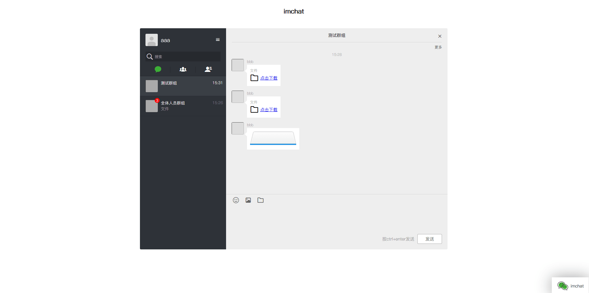

### fastadmin用户聊天系统插件



本插件基于workman+websocket实现的简易聊天系统，适用于前台用户的聊天，目前已经实现群聊、单聊、聊天记录、表情发送、图片以及文件发送、不过文件发送未做鉴权。bat脚本仅适用于开发，window上面可能会出现各种问题。

- 本插件依赖"workerman/gateway-worker": "^3.0"，请自行composer安装。
- 聊天服务器启动文件在application/push/目录下
- 安装后可直接测试，用户取自fastadmin的user表人员系统，聊天记录群组是否阅读不存在实际意义。
- 实际使用可能需要手动将需要加入聊天系统的页面 include聊天页面（代码如下），建议放在尾部，容易适配，也可自行调试，此聊天必须登录。
```
{if $Think.cookie.token}
    {include file="../addons/imchat/view/index/imchat.html" /}
{/if}
```

#### 常见问题
- 发送消息时提示stream_socket_sendto()，常见于window环境，重启apache等web服务器即可

#### 下载安装
clone后自行打包zip到fastadmin后台离线安装或者下载后离线安装即可